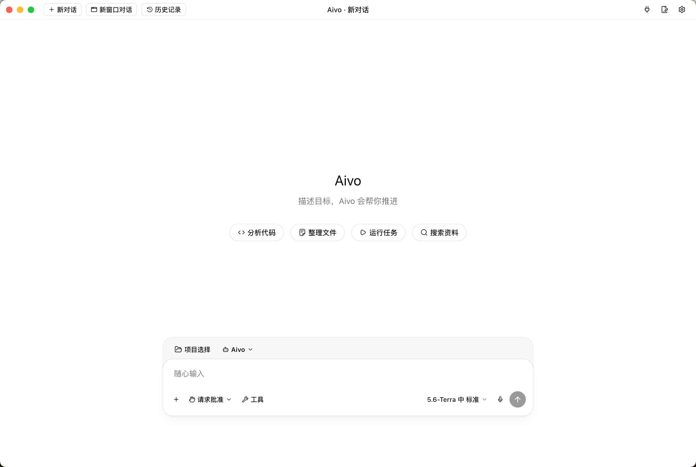

# Aivo

本地优先的 AI Agent 桌面工作台

[](https://github.com/atlantis-mk/Aivo/releases/latest)
[](https://github.com/atlantis-mk/Aivo/releases)
[](https://github.com/atlantis-mk/Aivo/actions/workflows/publish-release.yml)
[](LICENSE)
[](https://github.com/atlantis-mk/Aivo/releases)

连接你自己的模型，打开本地项目，让 Agent 帮你理解代码、修改文件、运行工具并验证结果。

_源码可用的非商业项目；当前仍在积极开发。_

[GitHub Releases](https://github.com/atlantis-mk/Aivo/releases) · [最新版清单](https://pub-bf5092e77ab5409ba39fb34c4a76c1b1.r2.dev/aivo/channels/stable/latest.json) · [项目文档](docs/00-spec-index.md) · [参与贡献](CONTRIBUTING.md)

Aivo 面向 macOS、Windows 和 Linux，由 Electron 桌面端与本地 Go Core 组成。它把模型提供商、项目、对话、工具、权限、终端、Worktree、Skills、Extensions 和 MCP 放在一个桌面工作区中，同时让文件、进程、凭据和持久化等特权能力留在本机受控服务内。

项目强调可见、可控的 Agent 工作流：你可以观察执行过程，在敏感操作前确认权限，随时取消长任务，并在完成后查看结果和运行证据。

## 产品截图



## 下载与安装

推荐从 [GitHub Releases](https://github.com/atlantis-mk/Aivo/releases/latest) 下载当前版本。发布资源也会同步到不可变的 Cloudflare R2 版本路径；[稳定通道清单](https://pub-bf5092e77ab5409ba39fb34c4a76c1b1.r2.dev/aivo/channels/stable/latest.json) 提供版本、文件大小、下载地址和 SHA-256。

| 平台 | 架构 | 安装包 |
| --- | --- | --- |
| macOS Apple Silicon | `arm64` | DMG / ZIP |
| macOS Intel | `x64` | DMG / ZIP |
| Windows | `x64` | NSIS 安装程序（EXE） |
| Linux | `x86_64` | AppImage |

每个正式版本同时提供 `SHA256SUMS`。macOS/Linux 可运行 `shasum -a 256 -c SHA256SUMS`；Windows 可使用 `Get-FileHash <文件> -Algorithm SHA256` 并与清单比较。

> 当前 macOS 和 Windows 安装包尚未签名，Linux 分发签名也未配置。操作系统可能显示“无法验证开发者”、SmartScreen 或类似提示。请只从本仓库的正式 Release 下载并核对 SHA-256；Aivo 不会绕过系统安全提示或静默安装。

## 首次启动

1. 打开 Aivo，进入首次设置。
2. 连接模型提供商。内置入口包括 OpenAI、Claude Code、Gemini，也支持目录中的其他提供商和兼容的自定义 API。
3. 选择初始化工作目录；未绑定具体项目的对话会在此目录工作。
4. 完成设置后，打开或添加本地项目并开始对话。
5. Agent 需要执行敏感工具或访问受控能力时，Aivo 会展示具体操作并等待确认。

提供商通常需要联网和相应的账号或 API 凭据。凭据由本地特权服务管理，不应进入渲染器、日志或公开 Issue。

## 主要功能

| 功能 | 说明 |
| --- | --- |
| 本地项目工作区 | 对用户选择的仓库或文件夹发起、继续和审阅 Agent 任务 |
| 多模型提供商 | 管理提供商连接、模型目录、默认模型、回退模型与运行策略 |
| 对话式 Agent | 在持续对话中提交任务、回答问题、取消执行并查看结果 |
| 文件与开发工具 | 支持读取、编辑、写入、Shell、终端、诊断和可选 LSP 能力 |
| 权限确认 | 在敏感操作前展示目标、作用域和确认状态，不把授权决定交给模型 |
| Agent 模式与子 Agent | 使用内置 Assistant、用户定义模式和受限的子 Agent 关联 |
| Skills、Extensions 与 MCP | 按明确的能力边界扩展工具、上下文、服务和隔离视图 |
| Worktree 与并行工作 | 为并行任务建立独立工作目录，并追踪创建、运行和清理生命周期 |
| 运行状态与上下文 | 展示工具活动、终端、token/cache 统计，并支持持久化上下文压缩 |
| 可信自动更新 | 启动后检查稳定通道，也可从设置或 macOS“检查更新…”手动触发；下载前交叉验证 R2 与 GitHub 摘要 |
| 多平台发布 | 在原生 GitHub Actions runner 上构建并冒烟验证 macOS、Windows 和 Linux 安装包 |

## 工作方式

```text
用户提交任务
   │
   └─ Electron 渲染器
      │  仅调用类型化 preload 能力
      ▼
   Electron 主进程
      │  管理桌面窗口、系统能力与本地 Core 生命周期
      ▼
   本地 Go Core（127.0.0.1）
      │
      ├─ 读取项目与对话上下文
      ├─ 调用用户配置的模型提供商
      ├─ 规划并发起工具、终端、MCP 或 Extension 操作
      ├─ 敏感操作 → 等待用户确认
      └─ 持久化本地状态并把进度、问题和结果返回桌面端
```

渲染器不能直接获得任意文件系统、进程、凭据或更新下载权限。长时间运行的 Agent、终端、流、MCP/LSP 客户端和子进程都由本地服务负责取消、边界控制和确定性清理。

## 本地数据与安全

- 项目文件、对话状态、配置和运行数据保存在本机；当前产品范围不包含 Aivo 账号、云同步、多用户协作或遥测。
- API key、OAuth token 和其他凭据只应进入受控的本地服务或安全存储，不进入渲染器与日志。
- 文件、命令、项目关联、Extension 安装和其他敏感能力保留用户确认边界。
- 更新器只接受固定的 Aivo R2 稳定通道与 GitHub 仓库，并要求包名、大小和 SHA-256 完全一致。
- 请勿在公开 Issue 中提交 token、密码、私有文件、数据库、用户提示词或其他敏感信息；安全问题请使用 GitHub Security 页面的私密漏洞报告。

## 项目结构

```text
apps/desktop   Electron main/preload 与 Vite/React 渲染器
core           Go Agent runtime、领域逻辑、持久化与本地 API
scripts        开发、构建、测试、打包和发布自动化
docs           产品、架构、数据、安全、测试与追踪规范
specs          跨模块聚焦规范
adr            架构决策记录
changes        Work Packages 与不可变完成清单
releases       已交付版本记录
```

开发和文档工作从 [`AGENTS.md`](AGENTS.md) 与 [`docs/00-spec-index.md`](docs/00-spec-index.md) 开始。它们定义当前范围、架构所有权、Work 流程和验证门禁。

## 本地开发

需要 Node.js 24、pnpm 11.1.1 和 Go 1.25。

```bash
git clone https://github.com/atlantis-mk/Aivo.git
cd Aivo
pnpm install --frozen-lockfile
pnpm dev
```

`pnpm dev` 会先启动本地 Go Core，等待 `http://127.0.0.1:43117/health` 就绪，再启动 Electron/Vite 桌面端。

常用命令：

| 命令 | 用途 |
| --- | --- |
| `pnpm dev` | 启动 Go Core 与桌面开发环境 |
| `pnpm dev:core` | 仅启动 Go Core |
| `pnpm test:core` | 运行全部 Go 测试 |
| `pnpm scripts:test` | 运行发布脚本和桌面模型测试 |
| `pnpm docs:check` | 验证规范、追踪和 Work 归档完整性 |
| `pnpm lint` | 检查桌面 TypeScript/React 代码 |
| `pnpm build` | 类型检查并构建桌面端 |
| `pnpm package` | 为当前平台生成安装包，不自动发布 |
| `pnpm diagnostics` | 运行文档、脚本、Core、lint 和 build 门禁 |

提供商后端诊断：

```bash
cd core
go run ./cmd/aivo-core provider-smoke --provider <provider> --model <model>
```

## 发布

正式发布使用同名版本记录与 Git tag，例如 `releases/v0.2.0.md` 和 `v0.2.0`。版本必须与根目录及桌面端的 package manifest 一致。

推送标签后，`.github/workflows/publish-release.yml` 会：

1. 运行文档、脚本、Go Core、lint 和 build 门禁。
2. 在 macOS Apple Silicon、macOS Intel、Windows x64 和 Linux x64 原生 runner 上打包并冒烟验证。
3. 生成规范化安装包与 `SHA256SUMS`。
4. 先发布不可变 R2 版本资源，再更新稳定通道清单。
5. 创建或恢复 GitHub Release，并拒绝摘要缺失或内容冲突的既有资源。

完整的签名、恢复和发布约束见 [`docs/release-quality.md`](docs/release-quality.md)。

## 许可证

当前版本中由授权方拥有或有权许可的 Aivo 源代码按 [PolyForm Noncommercial License 1.0.0](LICENSE) 提供，SPDX 标识为 `PolyForm-Noncommercial-1.0.0`，仅允许该许可证定义的非商业用途。本项目是 source-available 软件，不是 OSI 认可的开源软件。

商业使用需要另行取得书面授权，联系 `atlantis-mk <atlanxg@gmail.com>`。完整权利边界见 [LICENSING.md](LICENSING.md)，商业授权入口见 [COMMERCIAL-LICENSE.md](COMMERCIAL-LICENSE.md)，贡献规则见 [CONTRIBUTING.md](CONTRIBUTING.md)。

Required Notice: Copyright 2026 atlantis-mk <atlanxg@gmail.com>
