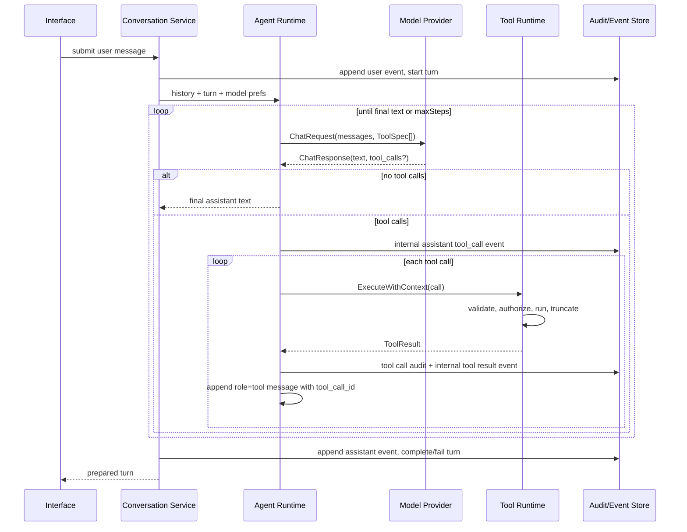

# Agent Runtime Architecture

## Research Summary

Aivo is a Electron desktop app with Go orchestration in `app`, durable domain types in `domain`, SQLite persistence in `infra/persistence`, and React routes/features in `frontend/src`. User messages enter through the desktop/workbench UI, cross the typed Aivo bridge service boundary, are persisted as session events, and are processed by `Service.SubmitSessionMessage`. The current conversation path builds recent `domain.ChatMessage` history, calls provider adapters through `GenerateChatResponseStream`, stores assistant events, and streams deltas to the frontend hook.

The model layer is already provider-aware. `app/llm_client.go` resolves configured providers, normalizes `domain.ChatRequest`, maps provider-neutral messages and tools to OpenAI Responses, OpenAI-compatible chat completions, Anthropic, Gemini, and ChatGPT Codex OAuth paths, and extracts streamed and non-streamed tool calls back into `domain.ChatResponse`.

Session state is durable. `domain/session_runtime.go` models sessions, turns, events, coding context, summaries, checkpoints, and tool call records. `app/session_runtime.go` owns state transitions and `infra/persistence/session_runtime.go` stores them in SQLite. Tool result events are internal and are not persisted as user messages.

Reference project takeaways:

- Codex separates model-visible tool definitions from executors, supports direct/deferred/hidden exposure, and puts shell permissions in deterministic exec policy plus sandbox layers.
- OpenCode separates tool dispatch from provider IO, uses schema decoding before execution, and evaluates permission rulesets with allow/ask/deny and saved approvals.
- Hermes uses a central self-registering registry, toolsets, availability checks, output limits, plugin hooks, todo/scheduler tools, and multiple execution backends such as local, Docker, SSH, and cloud.

For Aivo Phase 1 we borrow the separation of agent loop, tool runtime, registry, provider-neutral protocol, safe workspace handling, and audit events. We intentionally defer write tools, bash, MCP, plugins, scheduler, multi-agent routing, and remote execution until the permission and sandbox layers exist.

## Layering

```text
Interfaces
  CLI / TUI / Web / API / desktop / future messaging gateways
        ↓
Conversation Service
        ↓
Agent Runtime
        ↓
Model Provider Abstraction
        ↓
Tool Runtime
        ↓
Built-in Tools / Plugin Tools / MCP Tools
        ↓
Workspace / Sandbox / Permission / Audit
```

Interfaces collect user intent and render progress. They do not execute tools directly.

Conversation Service owns sessions, turns, event history, summaries, checkpoints, and persistence-safe message selection.

Agent Runtime owns the reasoning loop: build request, call model, inspect assistant tool calls, dispatch tools, append tool results, stop on final assistant text, cancellation, timeout, and max step limits.

Model Provider Abstraction converts provider-neutral messages, tool specs, tool calls, and streaming events to provider-specific APIs. Provider-specific formats must not leak into the agent loop.

Tool Runtime owns action execution: normalize call, find tool, validate JSON, resolve workspace, authorize, execute with timeout, sanitize, truncate, audit, and return a tool result.

Workspace, Sandbox, Permission, and Audit are lower-level services used by tools and runtime. They must be deterministic enforcement points, not prompt-only guidance.

## Module Boundaries

Agent Runtime: owns loop state, max steps, provider calls, tool result feedback, streaming handoff, and future multi-agent handoff. It does not read files, run commands, or persist arbitrary tool internals.

Conversation Manager: owns durable session and event records. It does not know provider payload shapes or execute tools.

Model Provider: owns provider request/response conversion, model capabilities, usage metadata, retries appropriate to provider IO, and streaming delta normalization. It does not authorize tools.

Tool Runtime: owns tool dispatch, timeout, output policy, audit envelope, and future permission checks. It does not mutate conversation history directly.

Tool Registry: owns tool registration, duplicate detection, specs, toolsets, availability, health, dynamic enable/disable, and future tool search/progressive loading.

Tool Executor: one implementation per tool. It receives a `ToolExecutionContext`, performs one capability, and returns structured `ToolResult`.

Permission Engine: owns allow/ask/deny decisions for tools, paths, commands, domains, secrets, sessions, and saved approvals. It does not rely on model compliance.

Workspace Manager: owns root resolution, safe joins, ignored directories, symlink escape checks, size limits, binary detection, and secret file detection.

Sandbox Runner: owns command/file execution backends: local first, then Docker, SSH, and future cloud workers. It is dormant in Phase 1.

Audit Log: owns structured records for tool calls, permission decisions, timing, truncation, workspace, approval, and errors.

Output Truncation / Compression: owns max chars/lines, redaction, structured output, raw artifact storage references, and summarization hooks.

Scheduler: owns one-time/recurring jobs, watch conditions, worker context, notifications, and scheduled permissions.

Plugin Runtime: owns plugin manifests, subprocess protocol, logging, sandboxing, and hook execution.

MCP Provider: owns MCP server discovery, schema import, namespacing, result normalization, permission bridge, and progressive loading.

Agent Modes / Toolsets: owns mode-specific prompts, visible tools, and default permissions.

## Agent Loop



The loop supports ordinary text replies, single and multiple tool calls, streamed tool call deltas, tool result feedback, max steps, cancellation through `context.Context`, provider errors, tool errors, and final explanation after failed tools. Future handoff will be another model-visible or internal event type, not a tool result disguised as a user message.

## Message Protocol

The provider-neutral protocol lives in `domain/tool_runtime.go`:

- `Message` / `ChatMessage`: `system`, `user`, `assistant`, `tool`, and future `developer` or `internal`.
- Assistant messages may contain `ToolCalls`.
- Tool messages carry `ToolCallID` and `Name`.
- `ToolCall` / `ChatToolCall`: stable call id, tool name, raw JSON arguments.
- `ToolResult`: call id, name, success flag, content, structured error, truncation metadata.
- `StreamingEvent`: text delta, tool call delta, tool result, or error.

Adapters must map OpenAI, Anthropic, Gemini, and local model variants into this shape. Tool result messages must stay `role=tool`; they must not be converted to user text. Persisted history should store raw events plus compressed context-safe content for future replay.
